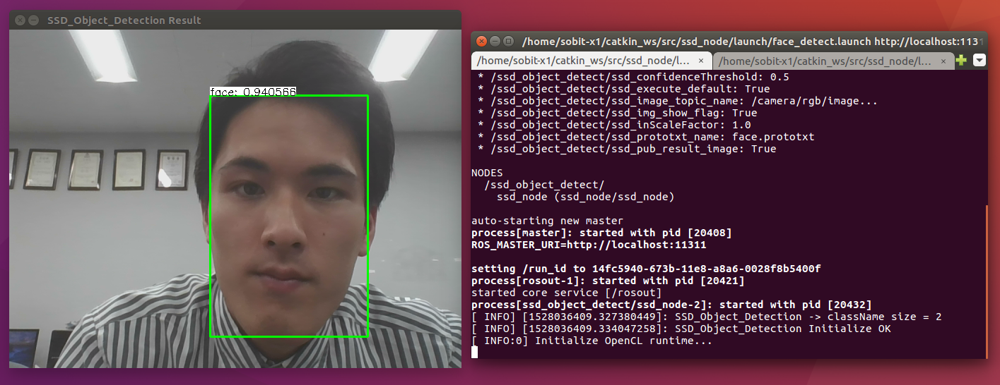

# SSD Nodelet

SSD(Single Shot MultiBox Detector)による物体検出（Nodelet実装）




## How To Use

```bash
$ roslaunch ssd_nodelet face_detect.launch  <- face detect mode
$ roslaunch ssd_nodelet object_detect.launch  <- object detect mode
```

### Publications:
 * /rosout [rosgraph_msgs/Log]
 * /ssd_object_detect/detect_result [sensor_msgs/Image]
 * /ssd_object_detect/objects_name [sobit_common_msg/StringArray]
 * /ssd_object_detect/objects_num [std_msgs/UInt8]
 * /ssd_object_detect/objects_rect [sobit_common_msg/BoundingBoxes]

### Subscriptions:
 * /camera/rgb/image_raw [sensor_msgs/Image]
 * /ssd_object_detect/detect_ctrl [std_msgs/Bool]

 <br>追記（2020/03/9）
 - tf_broadcaster_unique_class.cpp 
    - これはtfのクラス名が重複するのを防ぐために作成した
    - 例）personが2人いた場合： 
    <br>rviz のtf上で　"person_0",　"person_1"　と出力される
<注意>
    - 追跡機能はないので、クラス名が飛ぶことがある
    - 移動すると別のクラス名と判断されることがある

 <br>追記（2020/09/30）
 - BoundingBoxesStamp.msg
    - Header情報を付与したBoundingBoxes.msg
- ros_param = needs_time_stamp
    - BoundingBoxesStamp.msgでパブリッシュしたいときはlaunchの"needs_time_stamp"をtureにすること
    - tureにした場合，パブリッシュされるパス名は"/ssd_object_detect/objects_rect_stamp"に変わります

 <br>追記（2021/09/14）
 - object_detect_pose.launch の追加
    - message_filtersを用いて、物体の中心位置も検出と同時に取得します
    - topic名：/ssd_object_detect/object_poses
    - topic型：ssd_node/ObjectPosesStamp
    ```bash
    ssd_node/ObjectPose[] object_poses
        ssd_node/BoundingBox boundingBoxes
            string Class
            float64 probability
            int64 x
            int64 y
            int64 width
            int64 height
        geometry_msgs/Point center_position
            float64 x
            float64 y
            float64 z
    std_msgs/Header header
        uint32 seq
        time stamp
        string frame_id
    ```

