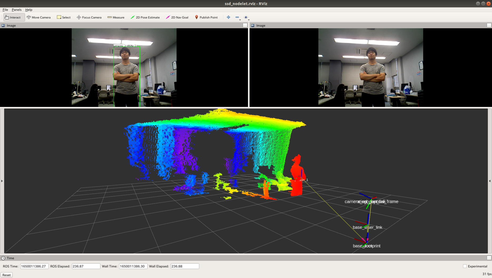

<a name="readme-top"></a>

[JP](README.md) | [EN](README_en.md)

[![Contributors][contributors-shield]][contributors-url]
[![Forks][forks-shield]][forks-url]
[![Stargazers][stars-shield]][stars-url]
[![Issues][issues-shield]][issues-url]
<!-- [![MIT License][license-shield]][license-url] -->

# SSD Nodelet

<!-- 目次 -->
<details>
  <summary>目次</summary>
  <ol>
    <li>
      <a href="#概要">概要</a>
    </li>
    <li>
      <a href="#セットアップ">セットアップ</a>
      <ul>
        <li><a href="#環境条件">環境条件</a></li>
        <li><a href="#インストール方法">インストール方法</a></li>
      </ul>
    </li>
    <li><a href="#実行操作方法">実行・操作方法</a></li>
    <li><a href="#マイルストーン">マイルストーン</a></li>
    <li><a href="#変更履歴">変更履歴</a></li>
    <!-- <li><a href="#contributing">Contributing</a></li> -->
    <!-- <li><a href="#license">License</a></li> -->
    <li><a href="#参考文献">参考文献</a></li>
  </ol>
</details>

<!-- レポジトリの概要 -->
## 概要

<!-- [![Product Name Screen Shot][product-screenshot]](https://example.com) -->

* SSD(Single Shot MultiBox Detector)による物体検出
* Nodelet実装による高速化
* 50Hzでカメラ画像を入力した場合
  
    SSD Node
    ```
    average rate: 12.962
        min: 0.050s max: 0.088s std dev: 0.00711s window: 77
    ```
    SSD Nodelet
    ```
    average rate: 49.889
        min: 0.015s max: 0.027s std dev: 0.00243s window: 49
    ```

<div align="center">
    
</div> 
<div align="center">
     
</div> 


<p align="right">(<a href="#readme-top">上に戻る</a>)</p>


<!-- セットアップ -->
## セットアップ

ここで，本レポジトリのセットアップ方法について説明します．

<p align="right">(<a href="#readme-top">上に戻る</a>)</p>

### 環境条件

正常動作のため，以下の必要な環境を整えてください．

| System  | Version |
| ------------- | ------------- |
| Ubuntu | 20.04 (Focal Fossa) |
| ROS | Noetic Ninjemys |
| Python | 3.0~ |

> [!NOTE]
> `Ubuntu`や`ROS`のインストール方法に関しては，[SOBITS Manual](https://github.com/TeamSOBITS/sobits_manual#%E9%96%8B%E7%99%BA%E7%92%B0%E5%A2%83%E3%81%AB%E3%81%A4%E3%81%84%E3%81%A6)に参照してください．

<p align="right">(<a href="#readme-top">上に戻る</a>)</p>

### インストール方法

```python
$ cd ~/catkin_ws/src/ssd_nodelet/
$ bash install.sh
$ cd ~/catkin_ws
$ catkin_make
```

<p align="right">(<a href="#readme-top">上に戻る</a>)</p>

<!-- 実行・操作方法 -->
## 実行・操作方法

### Camera
```bash
$ roslaunch ssd_nodelet camera_720p_16_9.launch
# 他に
# camera_1080p_16_9.launch  camera_480p_16_9.launch   camera_720p_16_9.launch
# camera_1080p_3_2.launch   camera_480p_3_2.launch    camera_720p_3_2.launch
```
※以下のようなエラーが発生した場合
```python
[ERROR] [1663911409.917317256]: Permission denied opening /dev/bus/usb/001/002
```
次のコードを実行してください
```python
sudo chmod o+w /dev/bus/usb/001/002
```

### Object Detect
```bash
$ roslaunch ssd_nodelet face_detect.launch  <- face detect mode
$ roslaunch ssd_nodelet object_detect.launch  <- object detect mode
```
### Object Pose Detect
```bash
$ roslaunch ssd_nodelet face_detect_pose.launch  <- face detect mode
$ roslaunch ssd_nodelet object_detect_pose.launch  <- object detect mode
```

### Publications:
|トピック名|型|意味|
|---|---|---|
|/ssd_object_detect/detect_result|sensor_msgs/Image|出力画像(検出結果)|
|/ssd_object_detect/object_name|sobits_msgs/StringArray|検出物体の名前のリスト|
|/ssd_object_detect/object_rect|sobits_msgs/BoundingBoxes|検出物体のバウンディングボックス情報|

#### Only Object Pose
|トピック名|型|意味|
|---|---|---|
|/ssd_object_detect/object_pose|sobits_msgs/ObjectPoseArray|検出物体の位置|

### Subscriptions:
|トピック名|型|意味|
|---|---|---|
|/camera/rgb/image_raw|sensor_msgs/Image|入力画像|
|/ssd_object_detect/detect_ctrl|std_msgs/Bool|検出のオンオフ|

#### Only Object Pose
|トピック名|型|意味|
|---|---|---|
|/camera/depth/points|sensor_msgs/PointCloud2|入力点群|

### Parameters:
|パラメータ名|型|意味|
|---|---|---|
|/ssd_object_detect/ssd_nodelet/ssd_img_show_flag|bool|検出画像の描画をするか|
|/ssd_object_detect/ssd_nodelet/ssd_execute_default|bool|起動時に検出を開始するか|
|/ssd_object_detect/ssd_nodelet/ssd_pub_result_image|bool|/detect_resultをパブリッシュをするかどうか|
|/ssd_object_detect/ssd_nodelet/ssd_image_topic_name|string|入力画像のトピック名|
|/ssd_object_detect/ssd_nodelet/ssd_in_scale_factor|double|Caffeで扱うBlob形式の変換時のスケールパラメータ|
|/ssd_object_detect/ssd_nodelet/ssd_confidence_threshold|double|検出結果リストに追加される結果の信頼度の閾値|
|/ssd_object_detect/ssd_nodelet/ssd_prototxt_name|double|string|prototxtファイルパス|
|/ssd_object_detect/ssd_nodelet/ssd_caffemodel_name|string|caffeモデルファイルパス|
|/ssd_object_detect/ssd_nodelet/ssd_class_names_file|string|検出する物体名リストファイルパス|
|/ssd_object_detect/ssd_nodelet/object_specified_enabled|bool|特定の物体のみ検出を行うか|
|/ssd_object_detect/ssd_nodelet/specified_object_name|string|検出する特定の物体名(物体ラベルにない名前は却下されます)|

#### Only Object Pose
|パラメータ名|型|意味|
|---|---|---|
|/ssd_object_detect/ssd_nodelet/use_tf|bool|tfによる座標登録するか|
|/ssd_object_detect/ssd_nodelet/target_frame|string|基準座標フレーム名|
|/ssd_object_detect/ssd_nodelet/ssd_cloud_topic_name|string|入力点群のトピック名|


<p align="right">(<a href="#readme-top">上に戻る</a>)</p>


<!-- マイルストーン -->
## マイルストーン

- [ ] ドキュメンテーションの充実 

現時点のバッグや新規機能の依頼を確認するために[Issueページ](https://github.com/TeamSOBITS/ssd_nodelet/issues) をご覧ください．

<p align="right">(<a href="#readme-top">上に戻る</a>)</p>


<!-- 変更履歴 -->
## 変更履歴

- 1.0: OSS (2023-11-14)
  - READMEの充実

<!-- CONTRIBUTING -->
<!-- ## Contributing

Contributions are what make the open source community such an amazing place to learn, inspire, and create. Any contributions you make are **greatly appreciated**.

If you have a suggestion that would make this better, please fork the repo and create a pull request. You can also simply open an issue with the tag "enhancement".
Don't forget to give the project a star! Thanks again!

1. Fork the Project
2. Create your Feature Branch (`git checkout -b feature/AmazingFeature`)
3. Commit your Changes (`git commit -m 'Add some AmazingFeature'`)
4. Push to the Branch (`git push origin feature/AmazingFeature`)
5. Open a Pull Request

<p align="right">(<a href="#readme-top">上に戻る</a>)</p> -->


<!-- LICENSE -->
<!-- ## License

Distributed under the MIT License. See `LICENSE.txt` for more information.

<p align="right">(<a href="#readme-top">上に戻る</a>)</p> -->


<!-- 参考文献 -->
## 参考文献

* [SSD: Single Shot MultiBox Detector](https://www.cs.unc.edu/~wliu/papers/ssd.pdf)

<p align="right">(<a href="#readme-top">上に戻る</a>)</p>


<!-- MARKDOWN LINKS & IMAGES -->
<!-- https://www.markdownguide.org/basic-syntax/#reference-style-links -->
[contributors-shield]: https://img.shields.io/github/contributors/TeamSOBITS/ssd_nodelet.svg?style=for-the-badge
[contributors-url]: https://github.com/TeamSOBITS/ssd_nodelet/graphs/contributors
[forks-shield]: https://img.shields.io/github/forks/TeamSOBITS/ssd_nodelet.svg?style=for-the-badge
[forks-url]: https://github.com/TeamSOBITS/ssd_nodelet/network/members
[stars-shield]: https://img.shields.io/github/stars/TeamSOBITS/ssd_nodelet.svg?style=for-the-badge
[stars-url]: https://github.com/TeamSOBITS/ssd_nodelet/stargazers
[issues-shield]: https://img.shields.io/github/issues/TeamSOBITS/ssd_nodelet.svg?style=for-the-badge
[issues-url]: https://github.com/TeamSOBITS/ssd_nodelet/issues
<!-- [license-shield]: https://img.shields.io/github/license/TeamSOBITS/ssd_nodelet.svg?style=for-the-badge
[license-url]: https://github.com/TeamSOBITS/ssd_nodelet/blob/master/LICENSE.txt -->
