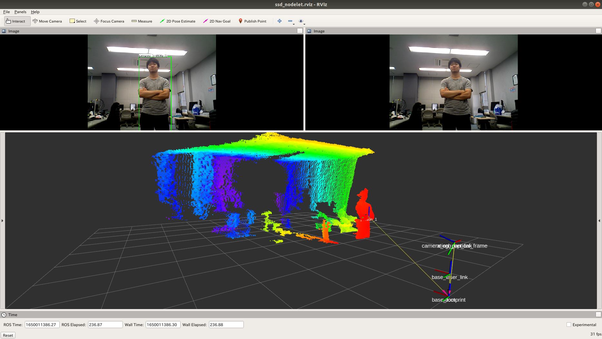

<a name="readme-top"></a>

[JP](README.md) | [EN](README_en.md)

[![Contributors][contributors-shield]][contributors-url]
[![Forks][forks-shield]][forks-url]
[![Stargazers][stars-shield]][stars-url]
[![Issues][issues-shield]][issues-url]
<!-- [![MIT License][license-shield]][license-url] -->

# SSD Nodelet

<!-- TABLE OF CONTENTS -->
<details>
  <summary>Table of Contents</summary>
  <ol>
    <li>
      <a href="#introduction">Introduction</a>
    </li>
    <li>
      <a href="#getting-started">Getting Started</a>
      <ul>
        <li><a href="#prerequisites">Prerequisites</a></li>
        <li><a href="#installation">Installation</a></li>
      </ul>
    </li>
    <li><a href="#launch-and-usage">Launch and Usage</a></li>
    <li><a href="#milestone">Milestone</a></li>
    <!-- <li><a href="#contributing">Contributing</a></li> -->
    <!-- <li><a href="#license">License</a></li> -->
    <li><a href="#acknowledgments">Acknowledgments</a></li>
  </ol>
</details>


<!-- INTRODUCTION -->
## Introduction

<!-- [![Product Name Screen Shot][product-screenshot]](https://example.com) -->

* Object detection by SSD (Single Shot MultiBox Detector)
* High speed by Nodelet implementation
* When camera image is input at 50Hz
    SSD Node
    ```
    average rate: 12.962
        min: 0.050s max: 0.088s std dev: 0.00711s window: 77
    ```
    SSD Nodelet
    ```
    average rate: 49.889
        min: 0.015s max: 0.027s std dev: 0.00243s window: 49
    ```

<div align="center">
    
</div> 
<div align="center">
     
</div> 


<p align="right">(<a href="#readme-top">back to top</a>)</p>


<!-- GETTING STARTED -->
## Getting Started

This section describes how to set up this repository.

### Prerequisites

The following environment must be in place for normal operation.

| System  | Version |
| ------------- | ------------- |
| Ubuntu | 18.04 |
| ROS | Melodic Morenia |

### Installation

```python
$ cd ~/catkin_ws/src/ssd_nodelet/
$ bash install.sh
$ cd ~/catkin_ws
$ catkin_make
```


<p align="right">(<a href="#readme-top">back to top</a>)</p>


<!-- LAUNCH AND USAGE EXAMPLES -->
## Launch and Usage

### Camera
```bash
$ roslaunch ssd_nodelet camera_720p_16_9.launch
# In addition
# camera_1080p_16_9.launch  camera_480p_16_9.launch   camera_720p_16_9.launch
# camera_1080p_3_2.launch   camera_480p_3_2.launch    camera_720p_3_2.launch
```
※If the following error occurs
```python
[ERROR] [1663911409.917317256]: Permission denied opening /dev/bus/usb/001/002
```
Execute the following code
```python
sudo chmod o+w /dev/bus/usb/001/002
```

### Object Detect
```bash
$ roslaunch ssd_nodelet face_detect.launch  <- face detect mode
$ roslaunch ssd_nodelet object_detect.launch  <- object detect mode
```
### Object Pose Detect
```bash
$ roslaunch ssd_nodelet face_detect_pose.launch  <- face detect mode
$ roslaunch ssd_nodelet object_detect_pose.launch  <- object detect mode
```

### Publications:
|Topic Name|Type|Meaning|
|---|---|---|
|/ssd_object_detect/detect_result|sensor_msgs/Image|Output image (detection result)|
|/ssd_object_detect/object_name|ssd_nodelet/StringArray|List of detected object names|
|/ssd_object_detect/object_rect|ssd_nodelet/BoundingBoxes|Bounding box information of detected object|

#### Only Object Pose
|Topic Name|Type|Meaning|
|---|---|---|
|/ssd_object_detect/object_pose|ssd_nodelet/ObjectPoseArray|Position of detected object|

### Subscriptions:
|Topic Name|Type|Meaning|
|---|---|---|
|/camera/rgb/image_raw|sensor_msgs/Image|Input image|
|/ssd_object_detect/detect_ctrl|std_msgs/Bool|Detection on/off|

#### Only Object Pose
|Topic Name|Type|Meaning|
|---|---|---|
|/camera/depth/points|sensor_msgs/PointCloud2|Input point cloud|

### Parameters:
|Parameter Name|Type|Meaning|
|---|---|---|
|/ssd_object_detect/ssd_nodelet/ssd_img_show_flag|bool|Whether to draw the detection image or not|
|/ssd_object_detect/ssd_nodelet/ssd_execute_default|bool|Whether to initiate detection at startup|
|/ssd_object_detect/ssd_nodelet/ssd_pub_result_image|bool|Whether to publish /detect_result|
|/ssd_object_detect/ssd_nodelet/ssd_image_topic_name|string|Topic name of input image|
|/ssd_object_detect/ssd_nodelet/ssd_in_scale_factor|double|Scale parameter when converting Blob format handled by Caffe|
|/ssd_object_detect/ssd_nodelet/ssd_confidence_threshold|double|Confidence threshold for results to be added to the detection results list|
|/ssd_object_detect/ssd_nodelet/ssd_prototxt_name|double|string|prototxt file path|
|/ssd_object_detect/ssd_nodelet/ssd_caffemodel_name|string|caffe model file path|
|/ssd_object_detect/ssd_nodelet/ssd_class_names_file|string|Object name list file path to detect|
|/ssd_object_detect/ssd_nodelet/object_specified_enabled|bool|Whether to perform detection only on specific objects|
|/ssd_object_detect/ssd_nodelet/specified_object_name|string|Specific object name to be detected (names not in the object label will be rejected)|

#### Only Object Pose
|Parameter Name|Type|Meaning|
|---|---|---|
|/ssd_object_detect/ssd_nodelet/use_tf|bool|Whether to register coordinates by tf or not|
|/ssd_object_detect/ssd_nodelet/target_frame|string|Reference Coordinate Frame Name|
|/ssd_object_detect/ssd_nodelet/ssd_cloud_topic_name|string|Topic name of input point cloud|

<p align="right">(<a href="#readme-top">back to top</a>)</p>


<!-- MILESTONE -->
## Milestone

- [ ] Enhanced documentation 

See the [open issues](https://github.com/github_username/repo_name/issues) for a full list of proposed features (and known issues).

<p align="right">(<a href="#readme-top">back to top</a>)</p>


<!-- CHANGE-LOG -->
## Change-Log

- 1.0: OSS (2023-11-14)
  - Enhanced README


<!-- CONTRIBUTING -->
<!-- ## Contributing

Contributions are what make the open source community such an amazing place to learn, inspire, and create. Any contributions you make are **greatly appreciated**.

If you have a suggestion that would make this better, please fork the repo and create a pull request. You can also simply open an issue with the tag "enhancement".
Don't forget to give the project a star! Thanks again!

1. Fork the Project
2. Create your Feature Branch (`git checkout -b feature/AmazingFeature`)
3. Commit your Changes (`git commit -m 'Add some AmazingFeature'`)
4. Push to the Branch (`git push origin feature/AmazingFeature`)
5. Open a Pull Request

<p align="right">(<a href="#readme-top">back to top</a>)</p> -->


<!-- LICENSE -->
<!-- ## License

Distributed under the MIT License. See `LICENSE.txt` for more information.

<p align="right">(<a href="#readme-top">back to top</a>)</p> -->


<!-- ACKNOWLEDGMENTS -->
## Acknowledgments

* [SSD: Single Shot MultiBox Detector](https://www.cs.unc.edu/~wliu/papers/ssd.pdf)

<p align="right">(<a href="#readme-top">back to top</a>)</p>


<!-- MARKDOWN LINKS & IMAGES -->
<!-- https://www.markdownguide.org/basic-syntax/#reference-style-links -->
[contributors-shield]: https://img.shields.io/github/contributors/github_username/repo_name.svg?style=for-the-badge
[contributors-url]: https://github.com/github_username/repo_name/graphs/contributors
[forks-shield]: https://img.shields.io/github/forks/github_username/repo_name.svg?style=for-the-badge
[forks-url]: https://github.com/github_username/repo_name/network/members
[stars-shield]: https://img.shields.io/github/stars/github_username/repo_name.svg?style=for-the-badge
[stars-url]: https://github.com/github_username/repo_name/stargazers
[issues-shield]: https://img.shields.io/github/issues/github_username/repo_name.svg?style=for-the-badge
[issues-url]: https://github.com/github_username/repo_name/issues
<!-- [license-shield]: https://img.shields.io/github/license/github_username/repo_name.svg?style=for-the-badge
[license-url]: https://github.com/github_username/repo_name/blob/master/LICENSE.txt -->